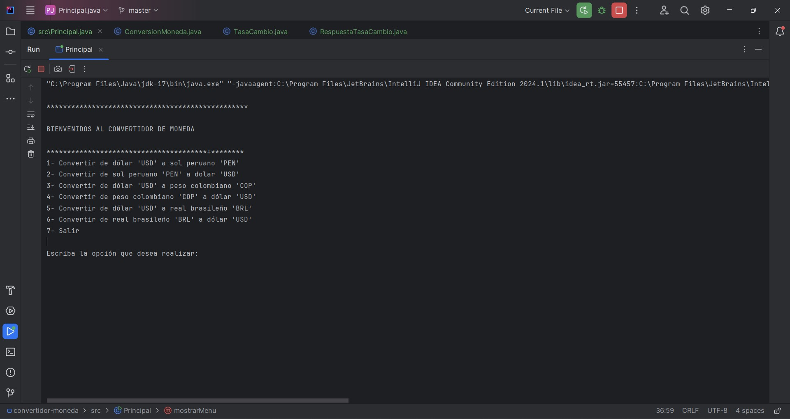
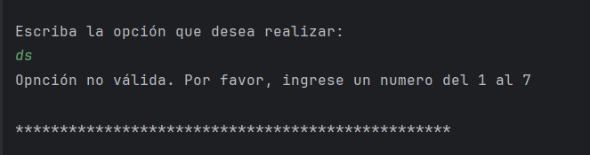
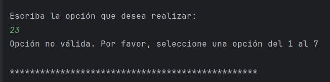
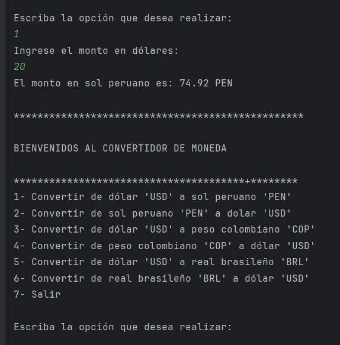
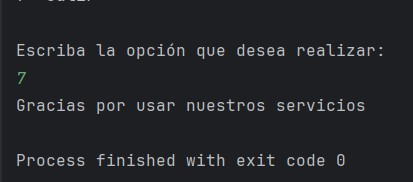
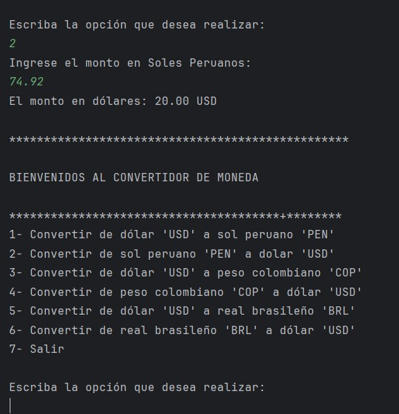

*********************************************************************
                                                  BIENVENIDOS
*********************************************************************

Es un gusto contar contigo en nuestro conversor de moneda. 
En este espacio, podrás acceder al cambio de moneda en dólares (USD) 
a las siguientes divisas: sol peruano (PEN), peso colombiano (COP) y 
real brasileño (BRL). Deseamos que tengas una experiencia fácil y 
agradable, por ello te presentamos una breve guía del conversor.

Inicialmente, te ofrecemos un listado de opciones. Debes escribir 
un número del 1 al 7, siendo el 7 la opción para finalizar el programa.

Es necesario que escribas el número de una de las opciones presentadas, 
ya que el sistema lo tomará como un error.

Como ejemplo, seleccionamos la opción 1. La acción a realizar será 
cambiar de dólares a soles peruanos. En el siguiente campo, escribimos 20
(dólares); cabe resaltar que el programa aceptará decimales antecedidos 
por punto. Finalmente, dará como resultado 74.92 PEN. Los resultados se 
presentarán con hasta dos decimales.

El programa desplegará nuevamente el menú de forma automática, 
por lo tanto, si deseas salir, deberás escribir la opción 7.

Para continuar con el ejemplo, escribiremos la opción 2. Esta dará la 
acción de convertir soles peruanos a dólares. Ahora, escribiremos el 
resultado anterior, 74.92 (PEN), que dará como resultado 20.00 USD.

¡Y listo, así de simple!

*********************************************************************
